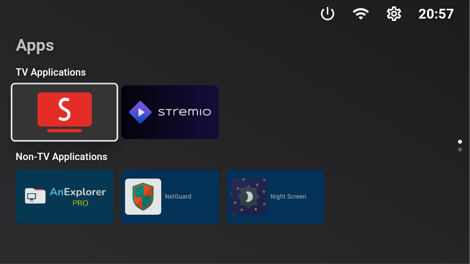
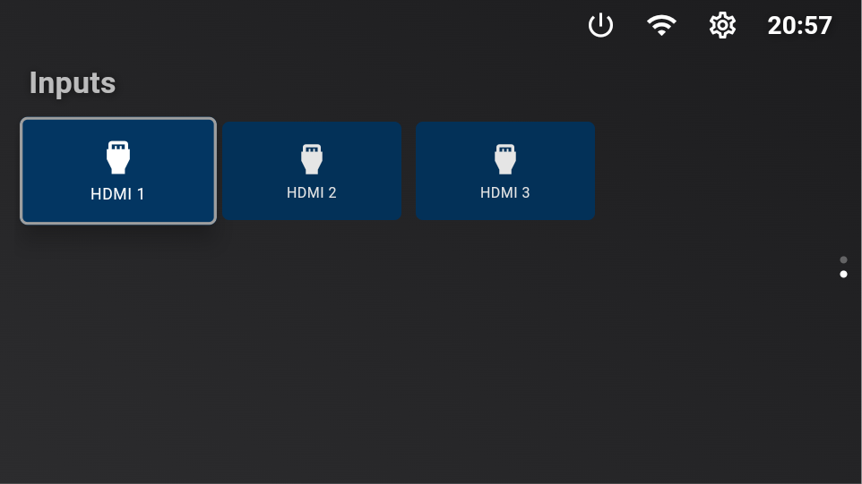
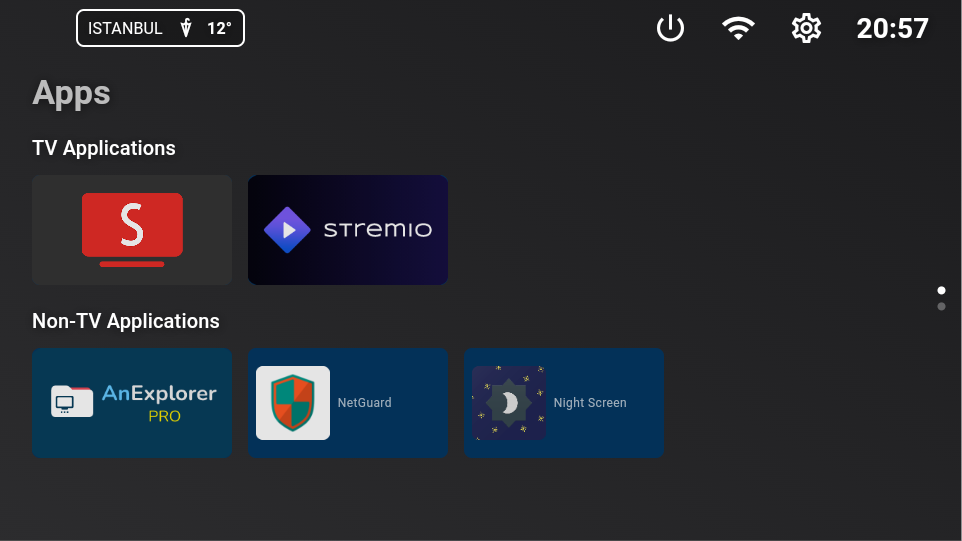
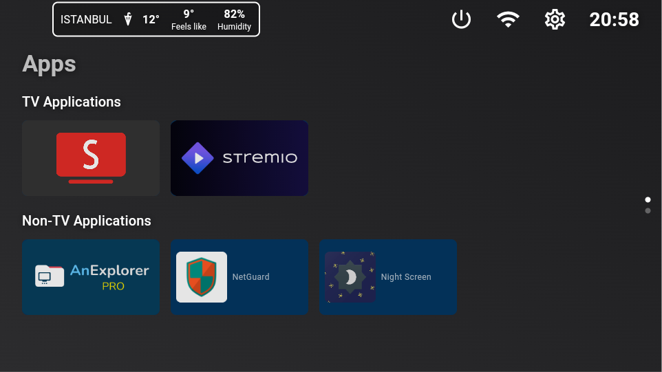

# FLaunchermod
FLaunchermod is an open-source alternative launcher for Android TV, built with [Flutter](https://flutter.dev).
Originally by efesser ([30 May 2021, first upstream tag](https://gitlab.com/flauncher/flauncher/-/tags/0.1.0)); ctnkyaumt 2026.

## Features
- [x] No ads
- [x] Customizable categories
- [x] Manually reorder apps within categories
- [x] Open "Android Settings"
- [x] Open "App info"
- [x] Uninstall app
- [x] Clock
- [x] Wifi icon for quick access
- [x] Switch between row and grid for categories
- [x] Support for non-TV (sideloaded) apps + menu to download popular apps for ease of use
- [x] Navigation sound feedback
- [x] HDMI inputs page/section
- [x] Weather widget
- [x] Speed Test with download/upload dials and HTTPS latency
- [x] Device power menu and standby through the enabled accessibility service
- [x] Button mapper integrated (under settings) — remaps remote buttons, including
      the app shortcut buttons (Netflix, YouTube, ...). Home and Power are handled
      by Android itself and cannot be remapped. See the
      [input architecture notes](docs/button-mapping-reference-analysis.md).
- [x] Backup/restore settings, layout, button mappings and wallpaper (local only)
- [ ] Force stop app

## Remap Netflix, YouTube and other app buttons

Open **Settings > Button Mapping** and enable FLauncher's accessibility service.
On TVs without a direct accessibility screen, the settings button opens the TV's
main Settings screen. Use **Map a button**, press the remote button, and choose
the replacement app yourself in the action picker. Back or Cancel ends capture;
capture also closes after ten seconds without a button.

If the button is not captured, connect the input reader and use **Map a firmware
button** for Netflix, YouTube and other factory buttons. On a TV already connected
to a computer through ADB, press **Connect**
and accept FLauncher's debugging prompt. TCP ADB also works on Android 11+; a
wireless-debugging pairing code is an alternative when supported. If necessary,
run `adb tcpip 5555` from the computer again after a reboot.

Raw mappings preserve the hardware usage code so Bluetooth factory buttons that
all report `KEY_UNKNOWN` can have different actions. Raw reading observes the
button; it cannot consume the firmware's original action. If that action still
opens an app, disable that particular app in Android settings if you no longer
need it. Existing app redirects from earlier versions remain supported, but the
mapping screen no longer offers app redirects or a separate button test screen.

When upgrading from the old `0.0.4` mapper, enable the new FLauncher accessibility
service again. Existing launcher layout and other app data are kept by an update.

## Device power

The top power button offers **Standby** and **Power menu**. Enable FLauncher's
accessibility service in Button Mapping first. Standby turns off the screen;
Power menu opens Android's own shutdown options. Requests can be closed with
Back or Cancel and time out if the device does not respond.

A regular launcher cannot directly shut down Android without system permission.
The power menu uses Android's supported accessibility action rather than hidden
APIs or root commands. Firmware still controls whether the TV stays off after
shutdown. See [Android's global actions](https://developer.android.com/reference/android/accessibilityservice/AccessibilityService#GLOBAL_ACTION_POWER_DIALOG).

## Backup and restore

Settings > Backup & Restore saves a JSON backup to Downloads on Android 10+,
with app-private storage as a fallback. Restore lists both locations; Browse
opens a document picker for backups copied from another device. Restore requires
confirmation and validates the entire file before changing data. Version 1
backups still work and leave existing button mappings and wallpaper alone.

Version 2 includes remote mappings, wallpaper and weather settings. Android
accessibility/storage permissions and ADB credentials are device-specific and
are not exported. Missing apps stay hidden with their category assignments;
installation is optional. Backups are limited to 32 MiB.

## Speed Test

Settings > Speed Test measures download, upload and HTTPS latency against
[Cloudflare's test endpoints](https://github.com/cloudflare/speedtest). Start with
the remote's OK button; Cancel, Back or leaving the app stops network traffic.
Tests normally take about 25 seconds and send/receive up to 192 MiB of test data.
Cloudflare receives the TV's IP address. Results are estimates for that server,
not a guarantee of ISP speed; faster connections can reach the data cap early.
The launcher does not submit results or run tests in the background.

Weather city search and Location display name use your selected Android system
keyboard. Press OK to type, then Search for a city or Save the display name.

## Screenshots
|--|--|--|--|
|  |  |  |  |

## Set FLauncher as default launcher

### Method 1: remap another button
Android handles the Home button internally and never dispatches it to apps, so it
cannot be remapped without root. Instead, use the button mapper under settings (of
flauncher) to point a different remote button — a colour button, Guide, or one of the
app shortcut buttons — at FLauncher. This requires enabling FLauncher's accessibility
service, which the button mapper screen links to.

### Method 2: disable the default launcher
**:warning: Disclaimer :warning:**

**You are doing this at your own risk, and you'll be responsible in any case of malfunction on your device.**

The following commands have been tested on Chromecast with Google TV only. This may be different on other devices.

Once the default launcher is disabled, press the Home button on the remote, and you'll be prompted by the system to choose which app to set as default.

#### Disable default launcher
```shell
# Disable com.google.android.apps.tv.launcherx which is the default launcher on CCwGTV
$ adb shell pm disable-user --user 0 com.google.android.apps.tv.launcherx
# com.google.android.tungsten.setupwraith will then be used as a 'fallback' and will automatically
# re-enable the default launcher, so disable it as well
$ adb shell pm disable-user --user 0 com.google.android.tungsten.setupwraith
```

#### Re-enable default launcher
```shell
$ adb shell pm enable com.google.android.apps.tv.launcherx
$ adb shell pm enable com.google.android.tungsten.setupwraith
```

#### Known issues
On Chromecast with Google TV (maybe others), the "YouTube" remote button will stop working if the default launcher is disabled. As a workaround, you can use [Button Mapper](https://play.google.com/store/apps/details?id=flar2.homebutton) to remap it correctly.

## Wallpaper
Because Android's `WallpaperManager` is not available on some Android TV devices, FLauncher implements its own wallpaper management method.

Please note that changing wallpaper requires a file explorer to be installed on the device in order to pick a file.

<a href="https://www.buymeacoffee.com/etienn01" target="_blank"></a>
